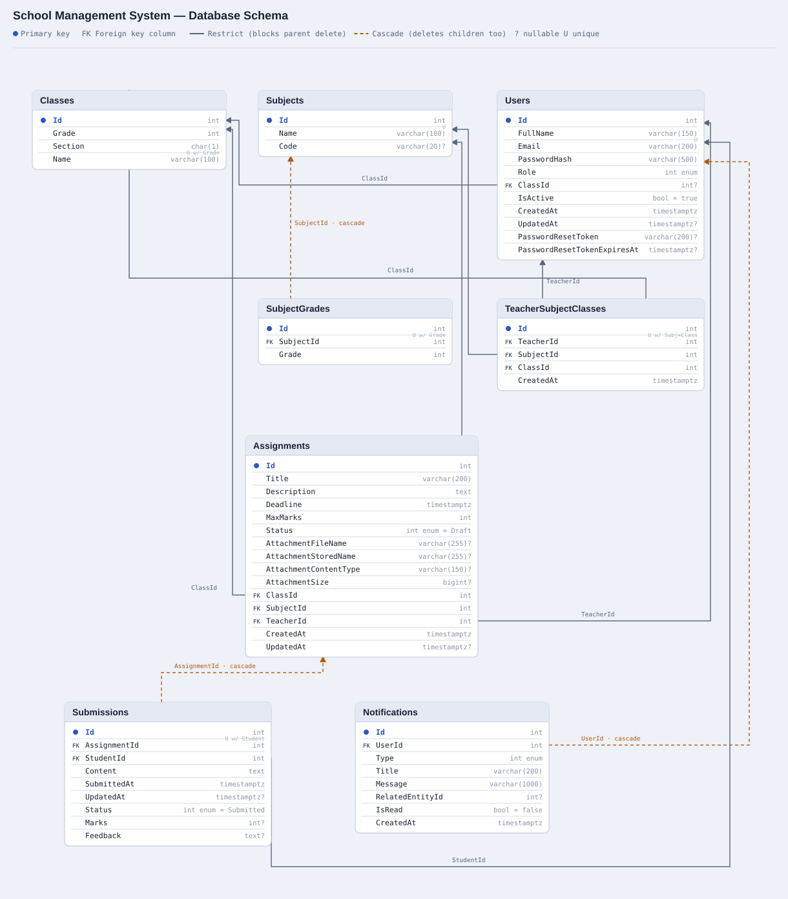

# School Management System

## Introduction

A role-based web application for a school or college. **Admins** manage users, classes, subjects, and teacher assignments with full oversight of the system; **Teachers** create, publish, and grade assignments; **Students** submit their work and track their marks and feedback. The frontend is a Next.js application, the backend a 3-tier ASP.NET Core API backed by PostgreSQL.

## Main Objective

The system exists to run a class's assignment-and-grading workflow end to end, with each role getting exactly the tools it needs and nothing it doesn't:

- Give Teachers a simple, reliable way to publish assignments and grade submissions.
- Give Students a clear view of what's due, what they've submitted, and how they did.
- Give Admins full visibility and control over users, classes, subjects, and teacher assignments — without needing backend access.

All access control is enforced server-side (JWT + role checks + ownership checks in the business layer); the frontend's routing is a convenience, not the security boundary.

## Key Technologies & Features

| Layer | Technology |
|---|---|
| Frontend | Next.js (App Router), React, TypeScript, Tailwind CSS, Axios, Zod, React Hook Form |
| Backend | ASP.NET Core Web API (.NET 9), C# |
| Database | PostgreSQL, Entity Framework Core (Npgsql provider) |
| Auth | JWT Bearer tokens, `PasswordHasher<T>` (PBKDF2) |
| API Docs | Swagger / OpenAPI |
| Testing | xUnit + Moq (57 backend tests) |

**Key features**
- JWT authentication, self-service registration, and OTP-based forgot/reset password (emailed)
- Full CRUD for Users, Classes, Subjects, and Teacher↔Subject↔Class assignments
- Assignment lifecycle (Draft → Published) with an optional file attachment (Word/PDF/Excel/image)
- Submission and grading workflow with deadline enforcement and marks validation
- In-app notifications for every role-relevant event
- Role-aware, live global search across the whole system
- Responsive UI with loading/empty/error states throughout

## Project Documentation

Detailed docs live in [`docs/`](docs/):

- [`docs/PLAN.md`](docs/PLAN.md) — architecture decisions, tech stack, current status
- [`docs/FRONTEND_SETUP.md`](docs/FRONTEND_SETUP.md) — frontend structure and setup
- [`docs/BACKEND_SETUP.md`](docs/BACKEND_SETUP.md) — backend structure and setup
- [`docs/FEATURES.md`](docs/FEATURES.md) — every feature traced end to end
- [`docs/DATABASE_SCHEMA.svg`](docs/DATABASE_SCHEMA.svg) — full entity-relationship diagram

## Database

PostgreSQL via EF Core, 8 tables, managed through migrations. `Users`, `Classes`, and `Subjects` are the core entities; `TeacherSubjectClasses` and `SubjectGrades` link them; `Assignments`, `Submissions`, and `Notifications` drive the day-to-day workflow.



## Project Architecture

```
Next.js Frontend  (app/, components/, services/, schemas/)
        |  Axios (JWT Bearer)
        v
ASP.NET Core Web API
        |
  Presentation Layer   SchoolMS.Api        Controllers, Middleware, Program.cs
        v
  Business Logic Layer SchoolMS.Business   Services, Interfaces, DTOs, Exceptions
        v
  Data Access Layer    SchoolMS.Data       DbContext, Repositories, Entities, Migrations
        v
PostgreSQL
```

Controllers depend only on `I*Service` interfaces, never on `AppDbContext` or repositories directly. Services hold all business rules and depend only on `I*Repository` interfaces. Repositories are the only layer that talks to EF Core — which is what lets `SchoolMS.Tests` test every business rule against mocked repositories, with no real database required.

## Getting Started

**Backend**

```bash
cd backend
dotnet run --project SchoolMS.Api --launch-profile http
```

**Frontend** (in a second terminal, with the backend running)

```bash
cd frontend
npm run dev
```
